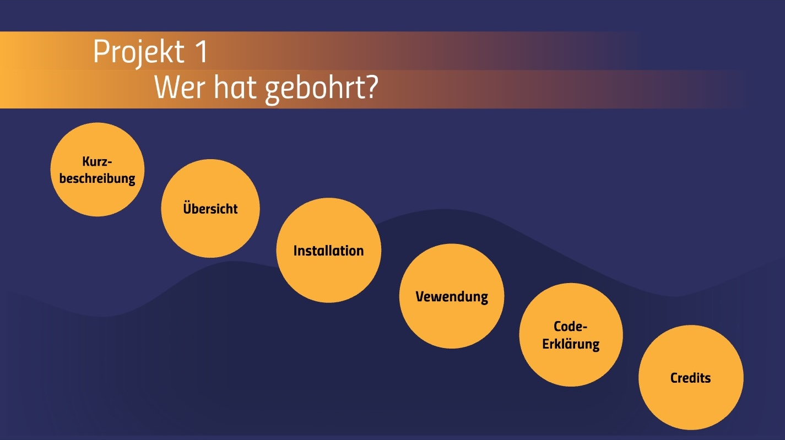
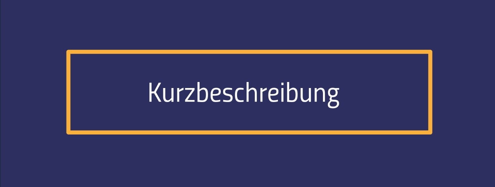
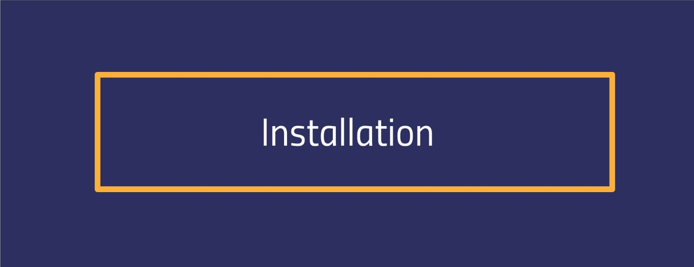
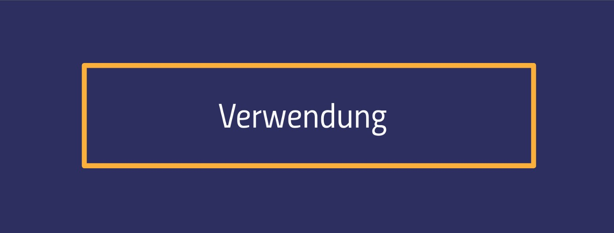
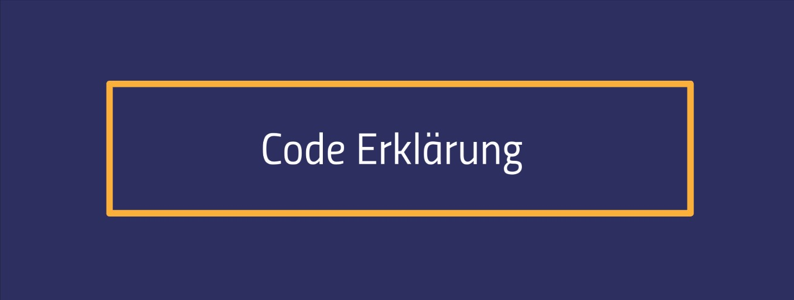
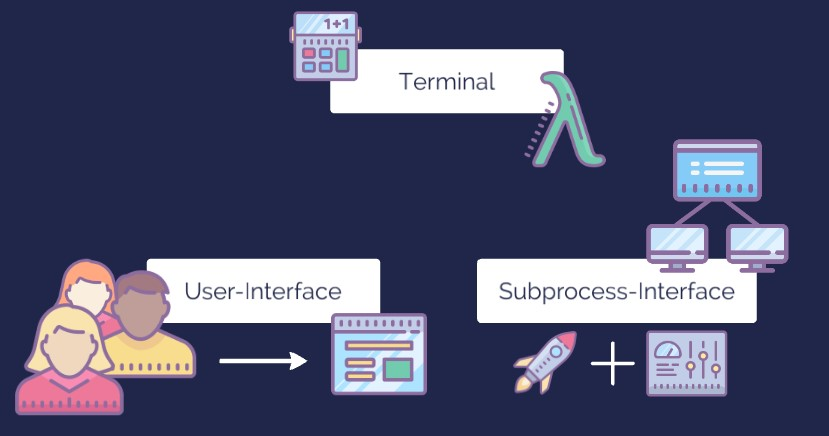
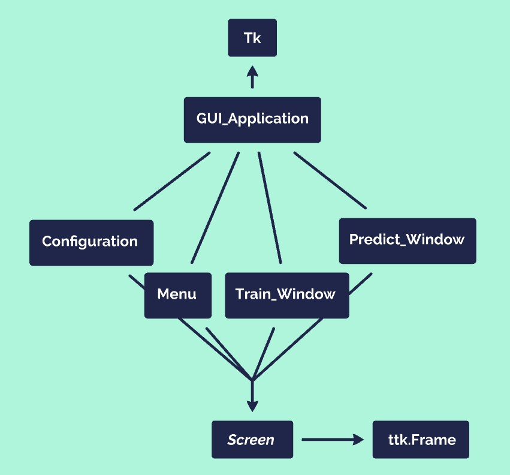
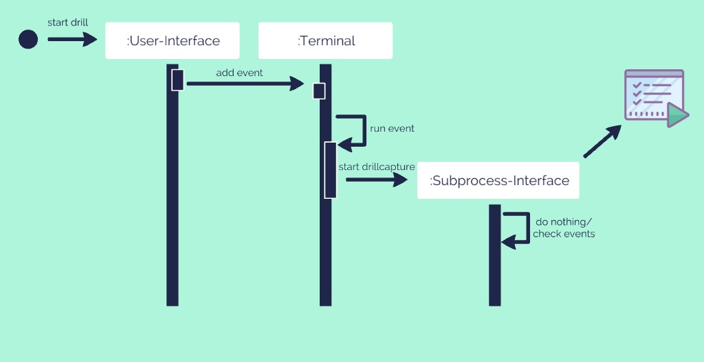

<br>
<br>
[Click here and check out our website for our library!](https://xxai-botxx.github.io/Wer-hat-gebohrt/)
<br>
<br>


Wer hat gebohrt? Ist ein Projekt von Studierenden des Studiegangs 'Angewandte Künstliche Intelligenz' im 3. Semester der Hochschule Offenburg.<br>Dabei geht es darum, dass der Computer 2 Bohrende unterschieden kann. Hierfür bohren beide mindestends ein Mal und anschließend bohrt einer von Beiden und ein MachineLearning-Algorithmus versucht mit einem gelerntem Muster aus den Daten den richtigen Bohrenden zu bestimmen.<br>Dabei gibt es eine Anwendung mit grafischer Benutzeroberfläche welche zum Bohren und zum Vorhersagen verwendet werden kann.

<br>


### /

- Der [**data**-Ordner](data) ist erstmal langweilig, da wir Bohrdaten nicht über Git speichern, sondern [extern](https://filr.hs-offenburg.de) speichern und lokal in diesen Ordner ablegen
- In dem [**doc**-Ordner ](doc) befinden sich verschiedene Dokumente im Zusammenhang unseres Projektes
  - [Aufgabenbeschreibung](doc/Aufgabenbeschreibung.md)
  - [Projekteinstieg](doc/Projekteinstieg.md)
- [**exploration**-Ordner](exploration) beinhaltet verschiedene beispielhafte Auseinandersetzungen mit den Projekt, daunter fallen auch Experimente
- [**src**-Ordner](src) alle Programme sind hier zu finden. Beinhaltet unteranderem unsere Python-Projekt-Bibliothek


### /exploration

- [**Tobia_Workspace**-Ordner](exploration/Tobia_Workspace) dient als Arbeitsplatz für Tobia und beinhaltet verschiedene Python-Scripte die man ebenfalls ansehen kann

- [**Syon_Workspace**-Ordner](exploration/Syon_Workspace) dient als Arbeitsplatz für Syon und beinhaltet verschiedene Python-Scripte die man ebenfalls ansehen kann

- [**Vadim_Workspace**-Ordner](exploration/Vadim_Workspace) dient als Arbeitsplatz für Vadim und beinhaltet verschiedene Python-Scripte die man ebenfalls ansehen kann


### /src

- [**anoog**-Ordner](src/anoog) ist unsere Python-Bibliothek für die Anwendung für den Live-Betrieb 

- [**DrillDummy**-Ordner](src/DrillDummy) beinhaltet Dummyvarianten um Drillcapture/Drilldriver für die Entwicklung zu ersetzen


### /src/anoog

- [**automation**-Ordner](src/anoog/automation) beinhaltet alle Dateien für das runnen der Anwendung (GUI, Terminal, Subprocess-Interface)

- [**io**-Ordner](src/anoog/io) beinhaltet alle Klassen und Methoden für das Laden der Daten

- [**model**-Ordner](src/anoog/model) beinhaltet alle Klassen und Methoden für die MachineLearning-Algorithmen in unserem Projekt

  
  <br>
  



**Verwendete Bibliotheken**

Für die Anwendung werden folgende externe Bibliotheken benötigt:

- Numpy

- Pandas

- Matplotlib

- Sklearn

- tsfresh

- pyyaml

- pillow

- ttkthemes

- webbrowser

  

Linux-Systeme müssen zusätzlich noch 2 Python Module installieren

- Tkinter 

  - ```terminal
    sudo apt-get install python3-tk 
    ```

- Pillow ImageTk

  - ```terminal
    sudo apt-get install python3-pil.imagetk
    ```


**Einfache Installationsart**

Für die Installation kann einfach die [requirements.txt](requirements.txt) verwendet werden. Hierzu einfach Folgendes ins Terminal eingeben:

```terminal
pip install -r requirements.txt
```


<br>




**Für den Live-Betrieb:**<br>[Diese Datei](src/RUN.py) wird auf einem dafür aufgesetzen Linux-Rechner mit einem dafür vorgesehen und angeschlossenen Bohrer mit angeschlossenen Sensoren gestartet.
Hierfür navigiert man mit dem Terminal in den src-Ordner und gibt folgenden Befehl ein **python3 RUN.py**.

Dabei muss sichergestellt sein, dass kein weiterer Drilldriver läuft. Um das zu tun, muss einfach der Output in der Konsole/Terminal überprüft werden und es muss **MCCUDP found!** dastehen. Fall dort etwas steht wie **MCCUDP Acquiring...** muss die Anwendung geschlossen werden und folgende Schritte befolgt werden:
1. Im Terminal **killall MCCUDP** eingeben
2. Erneut **killall MCCUDP** im Terminal eingeben
3. Anwendung mit **python3 RUN.py** starten
4. Anwendung schließen
5. Anwendung erneut starten und nun funktioniert alles wieder

**Sonst:**<br>Es kann auch mit den DrillDummy-Dateien gearbeitet werden. Dies geschieht dann unter Windows und man muss in der RUN.py diese Option ändern.<br>
Diese DummyDateien verhalten sich sehr ähnlich zu den echten Programmen und werden genauso angesteuert. Der Unterschied ist, dass zufällige Daten generiert werden, anstatt echte Sensordaten zu erhalten.
<br>
<br>
Ansonsten sind auch weitere Skripte ausführbar (in exploration), dafür wird meistens aber Testbohrdaten benötigt.

<br>



Unser Programm besteht zur Laufzeit aus 3 großen Komponenten und wurde komplett in Python programmiert. Die GUI (Graphical-User-Interface) nimmt die Wünsche des Users entegen und gibt diese dem Terminal weiter. Das Terminal verarbeitet diese Wünsche, veranlasst das Laden der gesammelten Daten und auch dessen Training und Vorhersage. <br>Das Subprocess-Interface hilft bei dem Starten und kommunizieren mit der Drilldriver und der Drillcapture Datei. Diese beiden Dateien sind für das sammeln und speichern der Bohrdaten von den Sensoren zuständig und wurden nicht von uns programmiert.



Und jetzt schauen wir uns diese 3 Komponenten etwas im Detail an. Es geht dabei nicht um die Implementierung. <br><br>**Die GUI**<br>Die GUI wurde in der Python-GUI-Bibliothek Tkinter programmiert. Damit sie modern aussieht, wurden alle Komponent nicht normal implementiert, sondern von ttk. Hier wird das Design von dem Betriebssystem genommen. Als Entwickler hat man dadurch weniger Möglichkeiten, jedoch sehen die Widgets zeitgemäß aus. <br>Außerdem wurde ttkthemes verwendet. Dieses Modul besitzt den Vorteil, dass man einen bestimmten Style wählen kann und alle Widgets sehen so aus. Wir haben uns für einen dunklen Style entschieden, was gut mit Farben kombiniert werden kann.<br><br>Bei Tkinter ist es so, dass es einen root gibt. Und jedes Widget muss einen Parent Widget haben (außer der root, dass ist der Startpunkt). Unsere GUI-Anwendung erbt von Tk und ist damit der root.<br>Nun gibt es verschiedene Frames, wie das Startmenu oder der Bohrscreen zum Trainieren. Diese haben den root als Parent und erben selber von Screen, was ein ttk.Frame ist und ein paar wenige Dinge beinhaltet.<br>Jeder Frame hat nun verschiede Children (Buttons, Labels, Textfields, ...), welche dann dessen Inhalt sind. <br>



Und so funktioniert unsere GUI auf abstrakter Ebene. Schau hierfür gerne in wer/src/anoog/automation/graphical_user_interface.py<br>Bevor wir uns das Terminal ansehen, werden wir noch einen Ausschnitt von der GUI betrachten. Um sie einmal gesehen zu haben.<br>


Links können sich die Benutzer mit den entsprechenden Merkmalen eintragen. Es ist auch schön zu sehen, wie spektakulär der Farbverlauf aus dem Dunkel hervortaucht. Rechts können die Bohrvorgänge / Sensoren gestartet und gestoppt werden. Es können neue Bohrungen hinzugefügt werden und falsche Bohraufnahmen gelöscht werden.<br>


Bei diesem Screen können nun Testbohrungen durchgeführt werden und der Algorithmus versucht die Bohrung/en einem der Beiden zuzuordnen. Toll dabei ist, dass man hier herum experimentieren kann. Der Algorithmus ist nämlich wählbar. Die Hyperparameter kann man entweder voreingestellt (von uns) lassen oder sie herausfinden lassen (was aber risikoreich sein kann). Ob die Daten hierfür normalisiert werden sollen, kann man ebenfalls entscheiden.<br><br>**Das Terminal**<br>Das Terminal kümmert sich vor allem um die Logik. Beispielsweise um das Erstellen von den Ordnerstrukturen für das Speichern der Messdaten.<br>Aber das Terminal lädt auch die gespeicherten Daten und lässt diese von einem Machine-Learning-Algorithmus trainioeren und predicten. Hierfür besitzt es ein AI-Model-Object. Dieses kümmert sich um genau um diese Dinge.<br>Es gibt natürlich noch mehr zum Terminal zu sagen, aber alles weitere würde zu sehr ins Detail gehen. Hier gibt es für uns also ertsmal nichts weiter zu sehen und wir gehen zum Subprocess-Interface.<br><br>**Das Subprocess-Interface**<br>Um die Drilldriver und Drillcapture starten zu können verwenden wir das subprocess-Modul von Python. Hier verwenden wir vor allem das Objekt Popen. Mit dem kann man einen Terminal/Konsole mit einem Befehl starten. Und damit starten wir einmal die Drilldriver und dann noch die Drillcapture. Wichtiger Unterschied ist hier, auf welchem Betriebssystem man sich befindet.


### Laufzeit

Nicht unerwähnte sollte man den Code bei Laufzeit lassen. Wir haben 3 Komponenten, welche miteinander interagieren und gleichzeitg laufen müssen. Für uns heißt das, dass alle 3 Kompontenen in Threads laufen. Die Kommunikation währendessen läuft über ein Eventsystem.<br>

<p align="center">

</p>


Und wir schauen uns dieses Eventsystem etwas genauer an. <br>Wenn man einem Objekt ein Event schicken möchte, ruft man die **add_event()**-Methode auf. Nun fügt das Objekt dieses Event in seiner Queue hinzu.<br>Falls das Objekt das Event ausführen möchte, kann es es aus der Queue nehmen. Doch was ist ein Event eigentlich? In diesem Fall einfach nur ein String bzw. ist repräsentiert dieser String einen Schlüssel in einer Hashmap. Und der Wert zu dem der Schlüssel führt ist eine Methode. EventHasmap[eventname] = event_function(). Vorteil hierbei ist, dass eine Hasmap sehr effizient ist.<br>Das Objekt kann also seine Eventqueue prüfen (ob sie leer ist). Falls nicht kann das Objekt das Event als Schlüssel für dessen Hashmap verwenden und führt so die Zielmethode aus. Und das ist das Eventsystem. <br>Hier eine Grafik, bei welcher man dieses Verhalten beobachten kann (zumindest teilweise):



Es soll ein Bohrvorgang gestartet werden. Der User drückt also einen Button, was den aufruf von add_event() beim Terminal nachsichzieht. Das Event was in der Queue vom Terminal gespeichert wird heißt beispielsweise 'start_drill'. In der Hashmap gibt es zu diesem Schlüssel eine passende Funktion start_drill(), welche mit dem Event beim nächsten Mal Prüfen der Eventqueue aufgerufen wird. Und was dann folgt ist für das Eventsystem nicht relevant.

Im Folgenden kannst du dir die Implementierung ansehen. So kannman es vielleicht besser verstehen. Außerdem ist der Code Unabhängig von einem Sachverhalt und damit gut auf andere Probleme übertragbar.

**Komponenten eines Eventsystem-Teilnehmers:**

- Event-Queue (zum Sammeln der Events)

  - ```python
    self.events = Queue()
    ```

- Event-Hashmap (zum Ausführen der Events)

  - ```python
    self.EVENT = {'event1':self.func_for_event1, 'event2':self.func_for_event2}
    ```

- Eine Methode, um ein Event ausführen zu können

  - ```python
    if not self.events.empty():
        event = self.events.get()
        # event = 'eventname' or event = 'eventname', *args
        if len(event) > 1:
        self.EVENT[event[0]](*event[1])
        else:
        self.EVENT[event[0]]()
    ```

- Eine Methode, damit Andere ein Event hinzufügen können
  - ```python
    def add_event(self, event_name, *additions):
          event = (event_name, *additions)
          self.events.put(event)

  

<br>


**Entwickler:**

- [Tobia Ippolito](https://github.com/xXAI-botXx/)

- Syon Kadkade

- Vadim Korzev

  

**Entwicklungshilfe und Special Thanks:**

- Prof. Dr. Daniela Oelke
- Stefan Glaser
- Mastergruppe


Dieses Projekt wurde in Zusammenhang mit der [Hochule Offenburg](https://www.hs-offenburg.de/) entwickelt.
